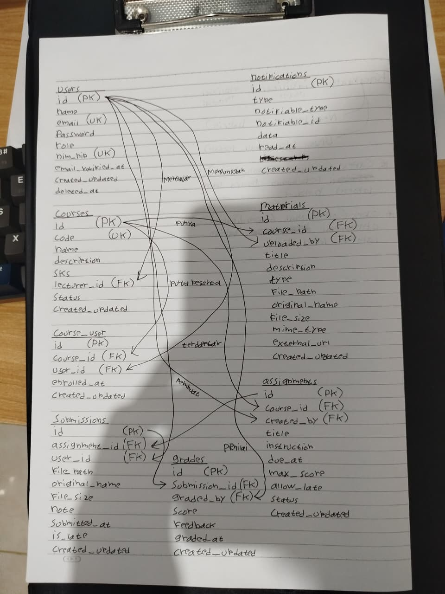

Nama : Hamzah Wiranata\
NIM : 10241035\
Kelas : A\

### READ — Baca skema sebelum menulisnya (30 menit)

Sebelum menyentuh kode, kerjakan bersama kelompok:

1. Gambar ulang ERD dari spesifikasi di papan/kertas, tanpa melihat dokumen.
2. Untuk setiap foreign key, tentukan perilaku `onDelete`-nya dan **tuliskan alasannya**.
3. Jawab: kalau seorang dosen dihapus, apa yang terjadi pada mata kuliahnya? Kenapa dirancang begitu?
4. Jawab: kenapa `grades.submission_id` bersifat unique, bukan sekadar index biasa?  

Jawaban
1. Hasil gambar ulang ERD
   
2. Tentuan `onDelete` daan alasannya
    `courses.lecturer_id` → `users.id`, **restrictOnDelete**.

    Mencegah penghapusan data induk (parent) jika data tersebut masih digunakan oleh data anak (child). Karena jika seorang dosen (`users.id`) dihapus dari sistem, namun akunnya masih tercatat sebagai pengajar di beberapa mata kuliah (`courses.lecturer_id`), sistem akan menolak penghapusan tersebut.

    `materials.course_id` → `courses.id`, **cascadeOnDelete**.

    karena jika sebuah kelas (`course`) dihapus, maka semua materi (`materials`) yang ada di dalam kelas tersebut secara logis sudah tidak memiliki fungsi atau acuan lagi. cascadeOnDelete memastikan bahwa saat Anda menghapus satu course, semua materials yang terhubung dengannya akan ikut terhapus secara otomatis oleh database.

    `assignments.course_id` → `courses.id`, **cascadeOnDelete**.

    Sama seperti sebelumnya, assignment juga akan terhapus karena tidak memiliki fungsi lagi jika kelasnya saja tidak digunakan.

    `subsmission.assignment_id` → `assignment.course.id`, **cascadeOnDelete**.

    Sama seperti assignment, penyerahan tugas dari mahasiswa sudah tidak relevan lagi kalau bahkan tugasnya saja dihapus.

    `graded.subsmission_id` → `subsmission.assignment.id`, **cascadeOnDelete**.

    Karena 'nilai' itu punya relasi one-to-one ke submission, maka kita tambahkan onDelete di subsmission juga (sebagai induk) yang kalau dihapus maka nilai juga ikut terhapus

3. Mata kuliah adalah child dari sebuah induk bernama dosen. Jadi ketika dosen dihapus maka mata kuliahnya ikut terhapus, karena berarti mata kuliah yang dulu pernah diajarnya sudah tidak relevan lagi.

4. Karena sebagai aturan relasi one-to-one yang mengharuskan satu subsmission hanya bisa memiliki satu grade. Satu tugas mahasiswa hanya bisa punya nilai satu.
---
### BREAK — Lima kerusakan (45 menit)

| # | Yang dicoba | Yang harus Anda amati |
|---|-------------|------------------------|
| 1 | Hapus `unique(['course_id','user_id'])` dari `course_user`, lalu daftarkan mahasiswa yang sama dua kali | Data ganda lolos tanpa keluhan |
| 2 | Tambahkan `role` ke `$fillable` model `User`, lalu kirim request pembuatan user dengan `role=admin` lewat form yang **tidak punya field role** | **Mass assignment nyata** — Anda baru saja jadi admin |
| 3 | Ganti seluruh `$fillable` dengan `protected $guarded = [];` lalu ulangi nomor 2 | Kenapa `$guarded` kosong dilarang |
| 4 | Kosongkan isi `down()` di satu migrasi, lalu jalankan `php artisan migrate:refresh` | Migrasi tidak reversible = CI merah |
| 5 | Ubah `restrictOnDelete` pada `lecturer_id` menjadi `cascadeOnDelete`, lalu hapus satu dosen | Kehilangan data berantai |